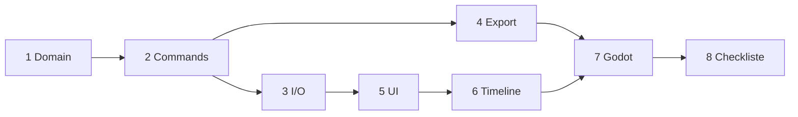

# Vertical Slice 1 — Aufgaben (5–8 Tasks)

Ziel: **End-to-End** „Rig minimal im Editor → Runtime-JSON → Godot lädt und zeigt etwas Sinnvolles“ gemäß Phase 1 in [09-roadmap-phasen.md](09-roadmap-phasen.md) und MVP in [02-anforderungen-mvp.md](02-anforderungen-mvp.md).

Abhängigkeiten sind als **DAG** gedacht: Tasks mit niedriger Nummer blockieren spätere nicht zwingend alle, aber die empfohlene Reihenfolge minimiert Rework.

---

## Task 1 — Domänenmodell & Validierung (`@skelio/domain`)

**Lieferobjekt:** Typen + reine Funktionen für minimales **Editor-Projekt** (nicht identisch mit Runtime-DTO): `Armature`, `Bone` (id, parentId, name, bindPose), optional leere `animations`-Struktur; `validateProject(project): ValidationIssue[]`.

**Akzeptanz:**

- Keine Vue/Tauri-Imports.
- Unit-Tests für: gültiger Baum, Zyklus wird erkannt, fehlende Referenzen werden gemeldet.

**Doku:** [04-datenmodell-schema.md](04-datenmodell-schema.md), [06-designpatterns-konventionen.md](06-designpatterns-konventionen.md), ADR [0007](adr/0007-runtime-koordinaten-rotation.md) (Einheiten im Modell konsistent halten).

---

## Task 2 — Commands & History (`@skelio/application`)

**Lieferobjekt:** `Command`-Schnittstelle + Handler für mindestens: `AddBone`, `RemoveBone`, `SetBindPose`, `SetKeyframe` (nur `tx`/`ty`/`rot`, Zeit in **Sekunden**); **Undo/Redo**-Stack (eine der in [06](06-designpatterns-konventionen.md) beschriebenen Strategien festlegen und dokumentieren).

**Akzeptanz:**

- Ketten von Commands + Undo reproduzierbar in Tests.
- Vue ruft nur Application-API auf (noch ohne UI vollständig: reine Tests reichen für diesen Task).

**Doku:** [05-modulgrenzen-schnittstellen.md](05-modulgrenzen-schnittstellen.md), [06-designpatterns-konventionen.md](06-designpatterns-konventionen.md), ADR [0006](adr/0006-runtime-zeitbasis-sekunden.md).

---

## Task 3 — Projektordner I/O (`@skelio/infrastructure`)

**Lieferobjekt:** Lesen/Schreiben eines **Ordnerprojekts** ([ADR-0004](adr/0004-projekt-persistenz-ordnerprojekt.md)): Manifest `project.skelio.json` (Editor-Schema, Version-Feld), `assets/` mit kopierten/referenzierten Dateien; klare Fehler bei fehlenden Pfaden.

**Akzeptanz:**

- Roundtrip: speichern → laden → gleiche Domäne (strukturell), Test mit temporärem Verzeichnis.

**Doku:** [04-datenmodell-schema.md](04-datenmodell-schema.md) (Editor vs Runtime trennen), [10-teststrategie-qualitaet.md](10-teststrategie-qualitaet.md).

---

## Task 4 — Runtime-Export & Schema-Check

**Lieferobjekt:** `mapProjectToRuntime(project): RuntimeJson` (Anti-Corruption Layer), Ausgabe erfüllt `schemas/runtime-1.0.0.json`; CI oder Test lädt Schema und validiert Fixture + einen **exportierten** Minimalfall.

**Akzeptanz:**

- `schemaVersion` und `meta.coordinateSystem: "y-down"` immer gesetzt ([0007](adr/0007-runtime-koordinaten-rotation.md), [0008](adr/0008-runtime-json-camelcase.md)).
- Bei Validierungsfehlern: strukturierte Fehlerliste (Pfad/Key) für spätere UI-Anzeige.

**Doku:** [04-datenmodell-schema.md](04-datenmodell-schema.md), `schemas/CHANGELOG.md`, [10-teststrategie-qualitaet.md](10-teststrategie-qualitaet.md).

---

## Task 5 — Desktop: State anbinden (minimal UI)

**Lieferobjekt:** Pinia oder schlanke Composables: **ein** `projectStore`, der Commands aus Task 2 auslöst; UI: **Hierarchy** (Liste/Baum) + **Inspector** für einen Bone (Name, Parent, Bind-Pose-Zahlen); optional rudimentärer **Viewport** (nur Linien), falls Zeit — sonst erst Zahlen-Editor.

**Akzeptanz:**

- Knochen hinzufügen/umbenennen über UI persistiert über Task 3 speicherbar.
- Keine Domäneninvarianten in `.vue` dupliziert.

**Doku:** [07-ui-workflow.md](07-ui-workflow.md), [03-systemarchitektur.md](03-systemarchitektur.md), ADR [0003](adr/0003-viewport-rendering-mvp.md) (Canvas nur wenn Viewport in diesem Slice).

---

## Task 6 — Timeline & Playback (Editor)

**Lieferobjekt:** Globale Timeline (eine Animation reicht): Current Time scrubben, Keys setzen/löschen, Play/Pause mit `meta.fps` als Anzeige; Zeit intern in Sekunden ([0006](adr/0006-runtime-zeitbasis-sekunden.md)).

**Akzeptanz:**

- Playback ändert angezeigte/current Pose (oder Zahlen im Inspector) konsistent mit Keys.
- Export (Task 4) spiegelt die gesetzten Keys.

**Doku:** [07-ui-workflow.md](07-ui-workflow.md), [02-anforderungen-mvp.md](02-anforderungen-mvp.md) (F-MVP-03/04).

---

## Task 7 — Godot: `SkelioPlayer` (GDScript)

**Lieferobjekt:** In `examples/godot-minimal/`: Laden von `fixtures/runtime-minimal.valid.json` **oder** einem aus dem Editor exportierten File; Node, der mindestens **Root-Bone-Translation** auf ein `Label`/`Sprite2D` mapped (sichtbarer Unterschied beim Wechsel der Zeit).

**Akzeptanz:**

- README beschreibt Godot-Version und wie man den Export einbindet ([08-godot-integration.md](08-godot-integration.md)).
- Referenz auf ADR [0005](adr/0005-godot-referenz-runtime-gdscript.md).

**Doku:** [08-godot-integration.md](08-godot-integration.md).

---

## Task 8 — Slice-Abschluss & Checkliste

**Lieferobjekt:** Kurze **manuelle Checkliste** in `CONTRIBUTING.md` oder `docs/14-…` Anhang: „Neues Projekt → Bone → Key → Export → Godot öffnen → sieht Bewegung“. Optional: GitHub-**Milestone** „Vertical Slice 1“ mit diesen Tasks als Issues (1:1 Mapping).

**Akzeptanz:**

- Fremde Person kann der Checkliste folgen (einmal intern durchspielen und Lücken schließen).
- `pnpm test` + `pnpm typecheck` grün; `CHANGELOG.md` Eintrag unter [Unreleased].

**Doku:** [09-roadmap-phasen.md](09-roadmap-phasen.md), [10-teststrategie-qualitaet.md](10-teststrategie-qualitaet.md).

---

## Reihenfolge (empfohlen)

**Hinweis:** Task 4 kann parallel zu Task 3 starten, sobald Task 1 steht (Mapper auf Domäne). Task 7 kann mit **statischer** Fixture beginnen und erst danach den echten Export anbinden.

---

## GitHub-Issues (automatisch)

Vorgefertigte Bodies: `.github/issues/vertical-slice-1/body-01.md` … `body-08.md`.  
Nach `gh auth login`: **`./scripts/create-vertical-slice-1-issues.sh`** (Hilfe: `.github/issues/vertical-slice-1/README.md`).  
Trockenlauf ohne `gh`: `DRY_RUN=1 ./scripts/create-vertical-slice-1-issues.sh`.
